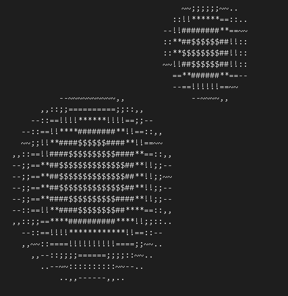

# My first docker - the spinning donut

For my first docker, I chose to reimplement the fancy spinning donut:
https://www.a1k0n.net/2011/07/20/donut-math.html

The project actually became a simple 3d graphics engine.

Part of the geometry behind is explained in `geometry.md`.

I proposed an OOP implementation to have multiple light sources and objects:
- `Object` class with fields `vertices` and `normal`, subclass with method `.rotate(angle: float)` 
- `Screen` for ray-tracing, with the fields `screen` and `depth_buffer`, and the methods `.update_ray(x,y,luminance, depth)` and `.display()`
- `Scene` with the fields `objects`, `positions` and `screen`, `.render` method
  
An aspect not taken into account is that the maximal distance between two neighbour vertices should be inferior to the maximal distance between two vertices within one pixel.

A first scene with two spheres:  

## A video

