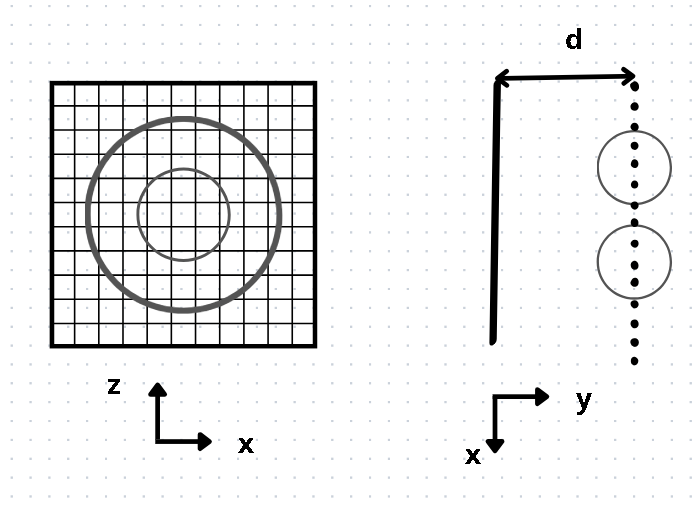
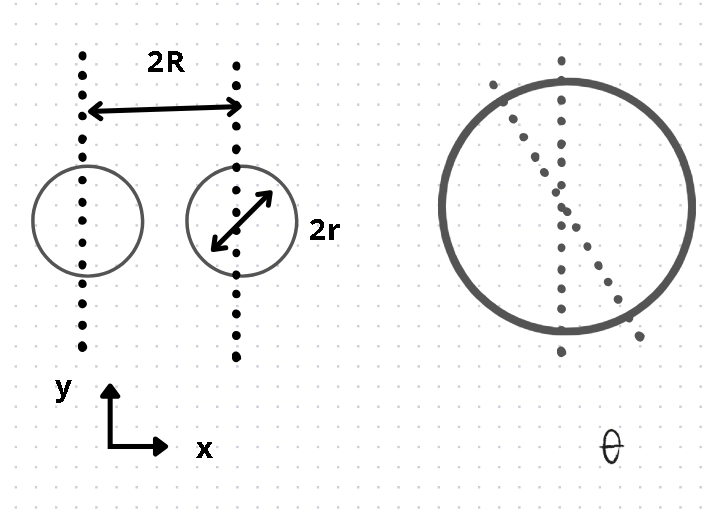
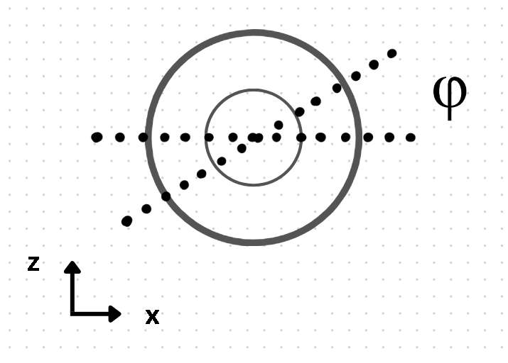

# Some 3d geometry

**Caveat: I went for a more generic OOP structure that allows to draw any mesh, see `geometry.pdf` for more drawings**

Starting from:
https://www.a1k0n.net/2011/07/20/donut-math.html

Here is the screen that I will use. I placed the donut at a distance such that it never pierces the screen. It is actually useless as I later consider that the viewer is at an infinite distance. The discretization grid correspond to the pixels (that will be characters of equal width in our case). $N^2$ will be the number of pixels.
I choose the screen to be the size of the donut. The width of a pixel is then:
$dx = (2R+2r)/N$

I will use a discretization of the 3d surface using a discretization of the angles $\theta$ and $\phi$. I will then project each point on the screen, taking into account its luminance.

## Discretization of the 3d surface

I want the maximal distance between two points to be inferior to the maximal distance between two points within one pixel.  
$r d\theta \leq dx$  
$(R +r) d\phi \leq dx$
I later use a safety factor to force a strict inequality.

### Rotation matrices

$$
R_z = \left(\begin{array}{ccc} 
\cos(\theta) & -\sin(\theta) & 0 \\
\sin(\theta) & \cos(\theta) & 0 \\
0 & 0 & 1 \\
\end{array}\right) $$

$$
R_y = \left(\begin{array}{ccc} 
\cos(\phi) & 0 & \sin(\phi) \\
0 & 1 & 0 \\
-\sin(\phi) & 0 & \cos(\phi)
\end{array}\right) $$

$$
R_x = \left(\begin{array}{ccc} 
1 & 0 & 0 \\
0 & \cos(\alpha) & -\sin(\alpha) \\
0 & \sin(\alpha) & \cos(\alpha)
\end{array}\right) $$

### Point and normal from angles

Given $\Omega = (0,-d, 0)$, $\omega = (R,0,0)$, one gets:  
$$ u(\theta,\phi, \alpha) = R_z(\alpha)(\Omega + R_y(\phi) (\omega + r R_z(\theta) e_x))$$
with the normal vector:
$$ n(\theta,\phi, \alpha) = R_z(\alpha)R_y(\phi)R_z(\theta) e_x$$

### Luminance

I consider that the viewer is at an infinite distance. The luminance then is:
$$l = |<n,e_y>|$$